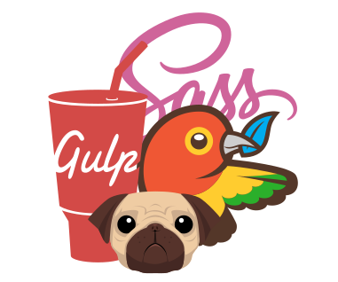

# Theme-builder

<!-- ![Image] -->

<p align="center">
	
</p>

#### **Theme-builder là bộ kit hỗ trợ viết code từ `pug/sass` sang `html/css/js`**

### Chức năng chính
- Tiết kiệm thời gian và công sức hơn so với việc viết `html/css` thuần
- Lazyload hình ảnh (Chỉ cần thêm `.lazy` vào `img`)
- Minify `image/css/js`
- `Prefixer CSS` hầu hết mọi trình duyệt
- Hỗ trợ viết JS chuẩn `ES2015`
- Auto Reload khi lưu file

### Công nghệ sử dụng
- [Node.js] - JavaScript runtime environment
- [NPM] - Node package manager
- [Gulp] - The streaming build system
- [Pugjs] - HTML template engine
- [SASS] - CSS pre-processor
- [Bower] - Package manager
- [BrowserSync] - Live CSS Reload & Browser Syncing

***

## Cài đặt

Để sử dụng bộ kit, bạn phải cài đặt [Node.js].

Nếu đã cài đặt [Node.js], bạn có thể bỏ qua bước này.

**Cài đặt `gulp`, `bower`, `node-sass`**

Bật **Terminal** hoặc **PowerShell** với quyền **Administrator** và chạy các lệnh sau:

```
npm install gulp bower node-sass -global
```

Nếu bạn đã cài đặt và sử dụng **Bower** trước đây, hãy bỏ qua lệnh này

```
Set-ExecutionPolicy -ExecutionPolicy RemoteSigned -Scope CurrentUser
```

> Lệnh này fix lỗi không sử dụng được **Bower** ở hệ điều hành Windows

**Chạy bộ kit**

Chạy 2 lệnh sau để cài đặt các package được sử dụng trong bộ kit:

```
npm i
bower update
```

Khởi động bộ kit

```
npm start
```

Bật browser và truy cập vào URL:

```
http://localhost:8000/
```

Bạn muốn truy cập website từ thiết bị khác hãy nhập URL sau:
> Các thiết bị phải kết nối chung bộ định tuyến(Router)

```
http://10.0.0.215:8000/
```

Bạn có thể thay đổi `PORT` mặc định tại `./config.json`

***

## Structure

| Input | Description | Output |
| ------ | ------ | ------ |
| `src/views/_layout.pug` | MasterPage của project | |
| `src/views/*.pug` | HTML được build ra từ đây | `dist/*.html` |
| `src/components/*.sass` | Các stylesheet của project | `dist/css/main.min.css` |
| `src/components/main.js` | Script được viết ở đây | `dist/js/main.min.js` |
| `src/assets/images/*` | Nơi chứa hình ảnh `*.{svg,gif,png,jpg,jpeg,webp}` | `dist/img/*` |
| `src/assets/fonts/fonts.css` | Import web-font vào CSS `@font-face` | `dist/fonts/global.min.css` |
| `src/assets/fonts/*` | Nơi chứa web-font `*.{woff2,woff,eot,ttf}` | `dist/fonts/*` |
| `config.json` object **`global`** | Import các JS library, font icons, CSS framework vào project | `dist/css/global.min.css` <br> `dist/js/global.min.js` <br> `dist/fonts/*` |


[//]: # (These are reference links used in the body of this note and get stripped out when the markdown processor does its job. There is no need to format nicely because it shouldn't be seen. Thanks SO - http://stackoverflow.com/questions/4823468/store-comments-in-markdown-syntax)

[Node.js]: https://nodejs.org/
[NPM]: https://www.npmjs.com/
[Gulp]: https://gulpjs.com/
[Pugjs]: https://pugjs.org/
[SASS]: https://sass-lang.com/
[Bower]: https://bower.io/
[BrowserSync]: https://www.browsersync.io/
[Image]: src/assets/images/gulp-pug-sass-bower.png